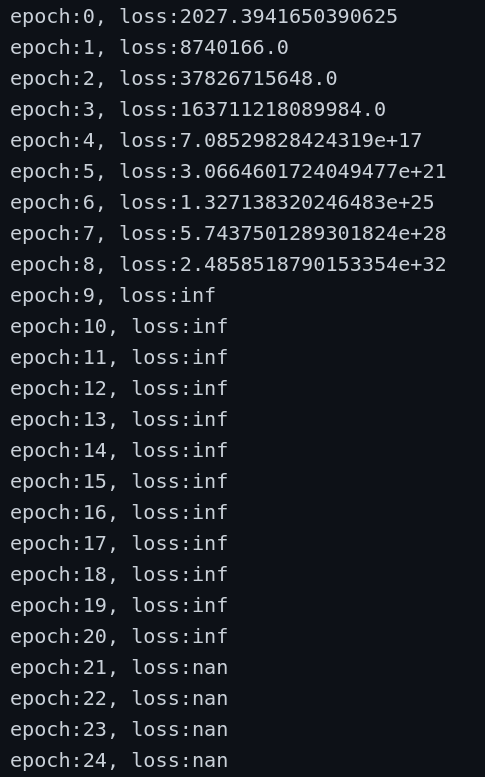

#  训练问题：
1. 注意：上来就出现nan有可能是data的问题：我的csv数据集就有垃圾数据导致出错！！！
2. lr不对有可能从有值到inf再到nan



# 代码问题：
1. 注意初始化：
```python
class linearRegression(torch.nn.Module):
	def __init__(self, inputSize, outputSize):
		super(linearRegression, self).__init__()
```


2. 注意清零：
```python
optimizer.zero_grad()

```

3. cuda使用


4. Variable使用
```python
Variable(torch.from_numpy(train_y).cuda())
```

5. plot参数使用：
```python
plt.plot(train_x, train_y, 'ro', label = 'origin points', alpha = 0.5, markersize = 0.9)
```